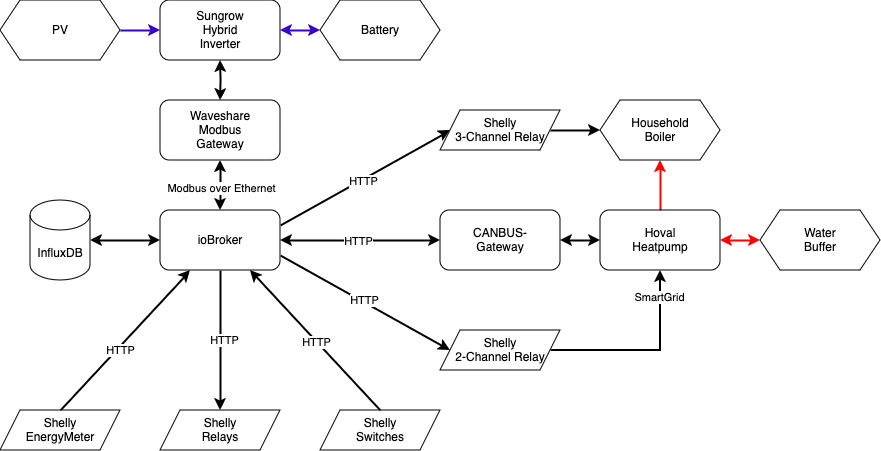

# iobroker
Power Management with Sungrow PV Inverter, Hoval Heat Pump &amp; Shelly Meter &amp; Switches

## PV system
  - Inverter: Sungrow SH20T with 3 MPP-Trackers
  - Battery: Sungrow SBR096 9.6 kWh
  - PV-Panels: 56x DAS Solar 445W Panels (2x strings with 19 panels, 1x string with 18 panels)

## Sungrow Modbus Integration
Since WiNet-S / WiNet-S2 does not provide reliable data until now we use the external RS485 connection.

- Model: [Waveshare RS485 to POE](https://www.waveshare.com/wiki/RS485_TO_POE_ETH_(B))
- Connection: SH20T "Logger" port on COM2 
- Settings: [Waveshare parameters](Waveshare-Modbus/parameters.md)

## Hoval Heat Pump
  - Model: Ultrascource B
  - Buffer: 300 lt

### Hoval CANbus Integration
The Hoval Modbus gateway seemed to be too expensive, so we decided to go for a CANbus gateway.
- Model: [Hoval CAN-Gateway](https://github.com/wladwnt/CAN-Gateway)

### SmartGrid
A Shelly 2-Channel Relay was used to control 2 Smart Grid inputs of the Howal Control Unit

